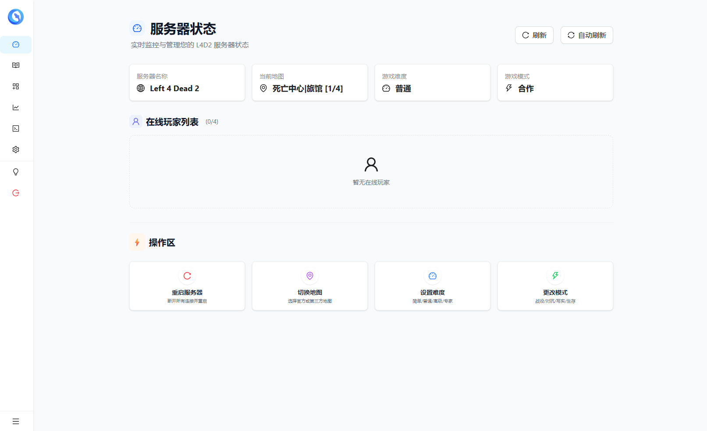
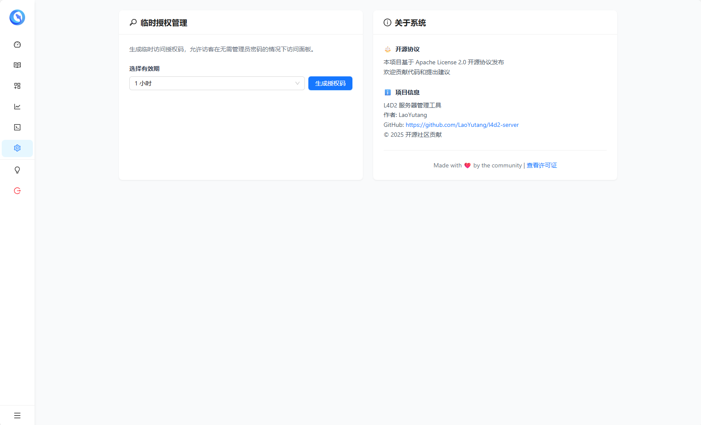
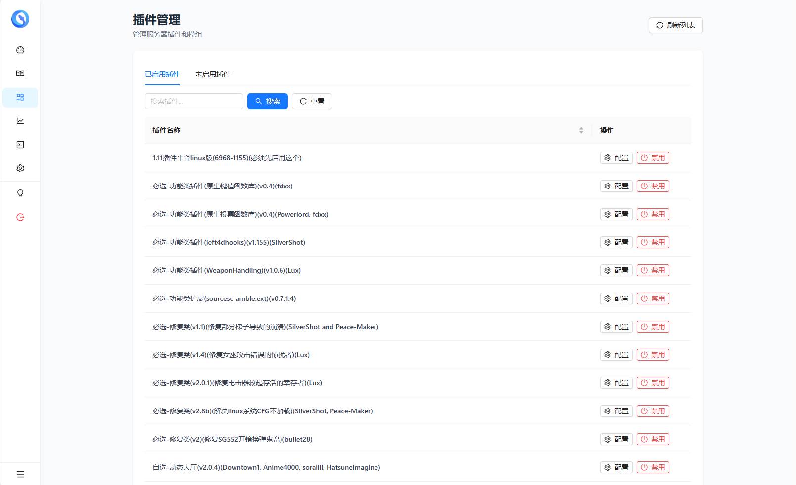
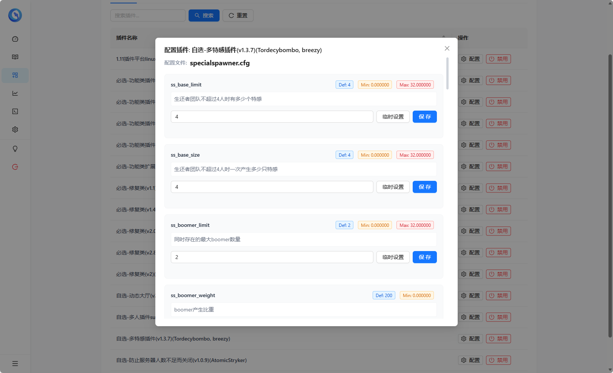
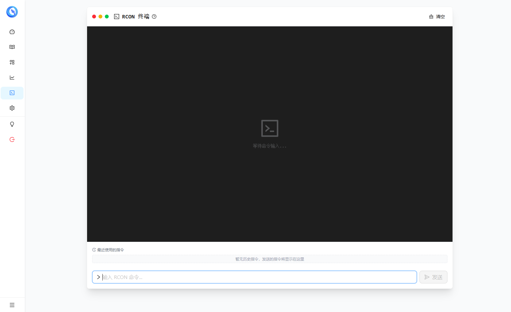
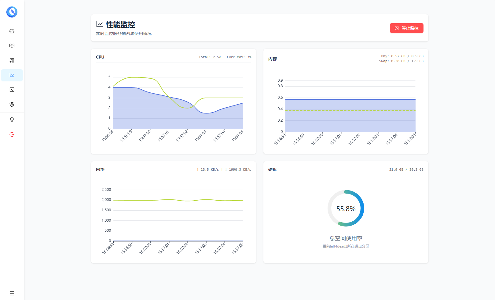
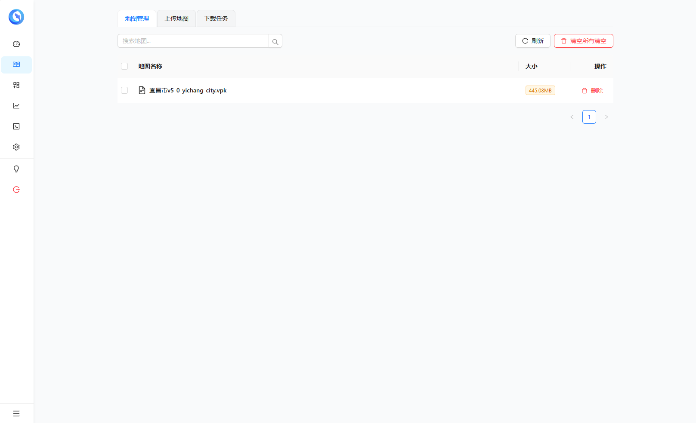
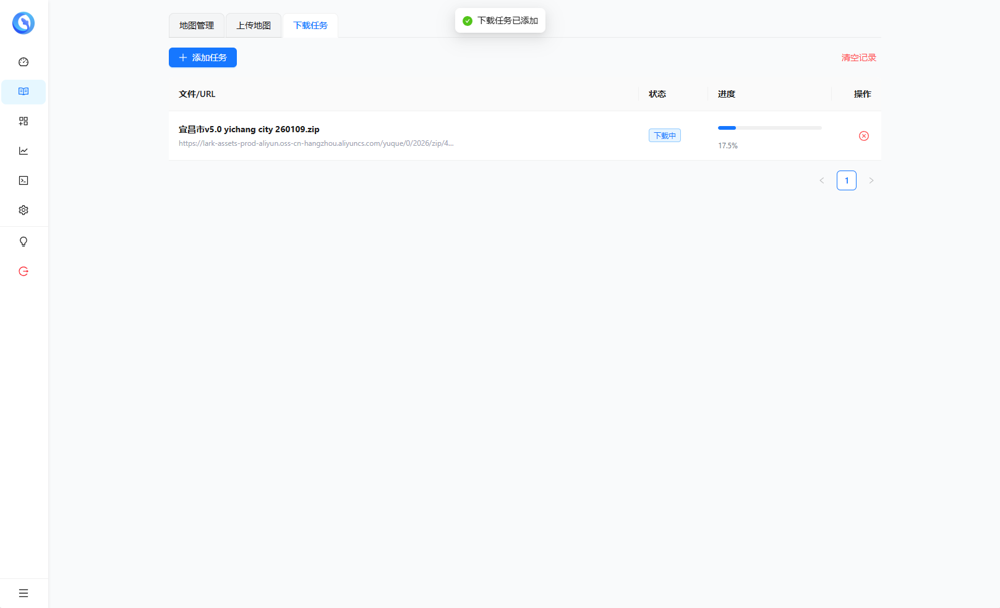

# l4d2-server-next

新一代求生之路 2 (L4D2) 服务器与 Web 管理后台。
提供 Docker 镜像与 Windows 原生程序，内置完整的整合包和大量优质插件，开箱即用！
支持地图管理、插件管理、服务器状态监控、玩家统计、日志查看、RCON 控制台等功能，让服务器管理变得简单高效。

## ✨ 功能特性

*   **🖥️ 多平台支持**
    *   **Docker**: 提供完整的游戏服镜像（`l4d2-pure`）与管理器镜像（`l4d2-manager-next`），一键部署。
    *   **Windows**: 提供原生 `.exe` 管理器，无需 Docker 即可管理现有的 Windows 服务器。
    *   **Linux**: 支持管理宿主机直接运行的 L4D2 服务端。
*   **🗺️ 地图管理**
    *   支持 `.vpk` 及 `.zip/.rar/.7z` 压缩包拖拽上传。
    *   自动解压安装地图文件到正确目录。
    *   地图下载任务：支持后台下载地图文件到服务器，可解析 Steam 创意工坊链接/合集、工坊 ID 与 QQ 闪传链接。
    *   可解析 VPK 内的 `missions/*.txt`，显示战役名、章节数量、章节代码与支持模式。
    *   地图列表支持按文件名或战役名搜索，支持详情查看、重命名、删除、批量删除与一键清空。
    *   支持一键切换地图、修改游戏模式、修改难度。
    *   支持地图资源精简：可开启上传/下载后自动精简，也可对已上传的单个 VPK 手动精简，降低服务器存储占用。
*   **🔌 插件管理**
    *   Web 端查看已安装的所有 SourceMod 插件。
    *   支持在线上传插件 ZIP，支持单插件包与多插件包批量导入。
    *   支持在线启用/禁用插件，支持批量启用、批量禁用、批量删除。
    *   支持启用并立即加载 `.smx`、禁用并立即卸载 `.smx`，减少重启次数。
    *   支持导出所有插件为 ZIP，便于备份和迁移。
    *   **内置整合包**: 镜像中已包含 SourceMod、Metamod 以及大量热门实用插件，开箱即玩。
    *   在线插件商店：直接在 Web 端浏览、搜索、安装 SourceMod 插件，支持代理、GitHub Token 与自定义公开插件仓库。[插件商店](https://github.com/LaoYutang/l4d2-plugins-store)
    *   支持插件预设方案，可通过 `preset.yaml` 管理预设组合，并在 Web 端一键批量应用。
    *   支持在线查看和编辑插件 CVAR 配置项，显示当前值、默认值和说明。
*   **📊 服务器监控**
    *   实时仪表盘：显示 CPU、内存、网络与硬盘占用。
    *   支持性能历史记录，可查看实时、1 小时、24 小时与 3 天趋势。
    *   游戏状态：显示当前地图、模式、难度、玩家数等。
    *   玩家列表：查看当前在线玩家、SteamID、连接时长、Ping 值。
*   **👥 玩家统计**
    *   玩家在线统计可在系统管理中开关，每 10 分钟采集一次玩家列表，数据滚动保留 30 天。
    *   支持按昵称或 SteamID 搜索玩家，显示排名、地区、最近出现时间与估算在线时长。
    *   支持查看玩家每日/小时在线趋势与历史昵称。
    *   通过 Steam API 查询玩家在 L4D2 的总游戏时长与实际游玩时长。
*   **💻 RCON 控制台**
    *   Web 端直接发送 RCON 指令，无需登录游戏。
    *   支持快捷指令菜单。
    *   快捷操作：踢出玩家、封禁 SteamID、修改服务器参数。
*   **🛡️ 安全与权限**
    *   Web 后台密码保护，防止未授权访问。
    *   支持可视化配置服务器管理员（无需手动编辑 admins_simple.ini）。
    *   GeoIP 访问控制: 支持按地区（如“中国”）拦截非法 IP 访问管理后台，保障面板安全。
*   **⚙️ 服务器配置**
    *   可视化编辑服务器名、服务器信息页与服务器公告（`l4d2_hostname.txt`、`host.txt`、`motd.txt`）。
    *   可视化管理 `server.cfg` 中的隐藏服务器、匹配连接、Steam 组 ID 与自定义参数。
    *   支持查看 SourceMod 运行日志、错误日志与其他日志文件，并实时推送新增日志内容。
*   **💾 备份与恢复**
    *   支持一键备份当前服务器的插件配置、管理员列表、服务器信息与服务器设置。
    *   支持导入备份文件，批量恢复配置。
    *   查看备份详情：包括插件配置列表、管理员列表、服务器信息快照、服务器设置快照。
*   **🔑 授权码与自助服务**
    *   支持生成临时授权码，可配置过期时间，方便分享面板访问权限。
    *   支持自助服务模式：授权码持有者可在有限权限下使用面板。

## 📸 预览截图

<div align="center">
  
  
  <br/>
  
  
  <br/>
  
  
  <br/>
  
  
</div>

---

## 🚀 Linux 部署

### 1. 完整部署 (游戏服务器 + 管理器)

适合从零开始搭建服务器的用户。

#### 方式一：一键脚本 (推荐) 【支持安装与管理】【多开/安装/删除/更新】
Cloudflare加速：
```sh
bash <(curl -sL l4d2-manage.laoyutang.cn)
```
官方源：
```sh
bash <(curl -sL https://raw.githubusercontent.com/LaoYutang/l4d2-server-next/master/manifest/install/manage.sh)
```

#### 方式二：Docker Compose

创建 `docker-compose.yaml`：

```yaml
volumes:
  l4d2-data:
  l4d2-plugins:
  l4d2-manager-data:

networks:
  l4d2-network:

services:
  # 游戏服务器
  l4d2:
    image: laoyutang/l4d2-pure:latest
    container_name: l4d2
    restart: unless-stopped
    ports:
      - "27015:27015"
      - "27015:27015/udp"
    volumes:
      - l4d2-data:/l4d2/left4dead2
      - /etc/localtime:/etc/localtime:ro # 同步宿主机时区
      - /etc/timezone:/etc/timezone:ro
    networks:
      - l4d2-network
    security_opt:
      - seccomp:unconfined # Docker 29.3+ 默认 seccomp 与 32 位 srcds 不兼容，低版本可省略此项
    environment:
      - L4D2_TICK=100 # 30,60,100,128
      - L4D2_VAC=false # false: 添加-insecure, true: 不添加
      - L4D2_PORT=27015
      - L4D2_RCON_PASSWORD=[rcon密码] # 请修改此处

  # 管理器
  l4d2-manager:
    image: laoyutang/l4d2-manager-next:latest
    container_name: l4d2-manager
    restart: unless-stopped
    ports:
      - "27020:27020"
    volumes:
      - l4d2-data:/left4dead2 # 与游戏服务器共享数据卷
      - l4d2-plugins:/plugins # 插件数据持久化
      - l4d2-manager-data:/data # 管理器运行数据持久化（key/监控/配置）
      - /proc:/host/proc:ro # 挂载宿主机进程信息用于监控
      - /etc/localtime:/etc/localtime:ro # 同步宿主机时区
      - /etc/timezone:/etc/timezone:ro
      - /var/run/docker.sock:/var/run/docker.sock # 允许管理器访问 Docker API（可选，若使用docker方式重启L4D2）
    environment:
      - L4D2_RESTART_BY_RCON=true
      - L4D2_MANAGER_PASSWORD=[web管理密码] # 请修改此处
      - L4D2_RCON_URL=l4d2:27015
      - L4D2_RCON_PASSWORD=[rcon密码] # 与上方保持一致
      - L4D2_GAME_PATH=/left4dead2
    networks:
      - l4d2-network
```
启动：
```sh
docker-compose up -d
```

> **关于 `security_opt` 配置**：Docker 29.3+ 版本的默认 seccomp profile 收紧了对部分 32 位 syscalls 的放行规则，导致 `srcds_linux` 无法正常启动。如果你使用的是 **Docker 29.3 以下版本**，可以删除上述 `security_opt` 字段。

### 2. 仅部署管理器 (Linux)

适合已有 L4D2 服务器（Docker 或宿主机部署），只需添加 Web 管理功能的用户。

```sh
docker run -d \
  --name l4d2-manager \
  --restart unless-stopped \
  --net host \
  -v /path/to/your/l4d2/left4dead2:/left4dead2 \
  -v l4d2-plugins:/plugins \
  -v l4d2-manager-data:/data \
  -v /proc:/host/proc:ro \
  -v /etc/localtime:/etc/localtime:ro \
  -v /etc/timezone:/etc/timezone:ro \
  -e L4D2_MANAGER_PORT=27020 \
  -e L4D2_MANAGER_PASSWORD=[web管理密码] \
  -e L4D2_GAME_PATH=/left4dead2 \
  -e L4D2_RCON_URL=127.0.0.1:27015 \
  -e L4D2_RCON_PASSWORD=[游戏服RCON密码] \
  -e L4D2_RESTART_BY_RCON=true \
  laoyutang/l4d2-manager-next:latest
```
注意修改 `/path/to/your/l4d2/left4dead2` 为实际的游戏目录。

---

## 💻 Windows 部署

适合在 Windows 机器上运行 L4D2 服务器的用户。

1. **下载管理器**：
   前往 [Releases](https://github.com/LaoYutang/l4d2-server-next/releases) 页面，下载最新的 `l4d2-manager-windows-amd64-vX.X.X.zip`。

2. **解压**：
   解压压缩包到任意目录（建议不要包含中文路径）。

3. **配置**：
   右键编辑 `start_manager.bat` 文件，修改以下配置：
   *   `L4D2_MANAGER_PASSWORD`: 设置 Web 管理后台密码。
   *   `L4D2_GAME_PATH`: 设置 L4D2 游戏目录（例如 `D:\SteamCMD\steamapps\common\Left 4 Dead 2 Dedicated Server\left4dead2`）。
   *   `L4D2_RCON_URL`: 游戏服务器 IP:端口（通常是 `127.0.0.1:27015`）。
   *   `L4D2_RCON_PASSWORD`: 游戏服务器的 RCON 密码（需在 `server.cfg` 中配置 `rcon_password`）。

4. **启动**：
   双击运行 `start_manager.bat`。

5. **访问**：
   打开浏览器访问 `http://localhost:27020`（或服务器 IP:27020）。

---

## ⚙️ 环境变量说明

| 变量名                     | 描述                                   | 默认值/必填                     |
| :------------------------- | :------------------------------------- | :------------------------------ |
| **L4D2_MANAGER_PASSWORD**  | Web 管理后台登录密码                   | **必填**                        |
| **L4D2_MANAGER_PORT**      | 管理器监听端口                         | `27020`                         |
| **L4D2_GAME_PATH**         | L4D2 游戏目录路径 (left4dead2 文件夹)  | **必填**                        |
| **L4D2_RCON_URL**          | RCON 地址 (IP:Port)                    | 推荐配置，否则无法切图/看状态   |
| **L4D2_RCON_PASSWORD**     | RCON 密码                              | 推荐配置                        |
| **L4D2_RESTART_BY_RCON**   | 是否通过 RCON 命令重启服务器           | `false` (推荐 `true`)           |
| **L4D2_RESTART_CMD**       | 非 RCON 重启时执行的自定义重启命令     | 可选                            |
| **L4D2_CONTAINER_NAME**    | 非 RCON 重启且未配置重启命令时的容器名 | `l4d2`                          |
| **L4D2_PLUGIN_STORE_PATH** | 插件库数据目录                         | `./plugins`                     |
| **L4D2_VAC**               | 游戏服是否启用 VAC                     | `false`（默认添加 `-insecure`） |
| **L4D2_TICK**              | Docker 游戏服 Tickrate                 | `30`，支持 `30/60/100/128`      |
| **L4D2_PORT**              | Docker 游戏服端口                      | `27015`                         |
| **STEAM_API_KEY**          | Steam API Key (用于查询玩家时长)       | 可选                            |
| **REGION_WHITE_LIST**      | GeoIP 区域白名单 (如: 中国)            | 可选 (不填则不拦截)             |

---

## 🗜️ 地图资源精简

地图资源精简用于把客户端才需要的资源从服务端 VPK 中移除，适合磁盘空间紧张或地图包体积很大的服务器。

使用方式：

*   在“系统管理 → 地图资源设置”中开启“地图自动精简”后，新上传或新下载的地图会在安装前尝试精简。
*   已经上传的地图可在“地图管理”列表中点击单个地图的“精简”按钮手动处理。

当前会移除的典型资源包括地图源文件（`.vmf/.vmx`）、材质贴图（`materials/*.vtf`）、声音（`sound/` 或 `sounds/` 下的 `.mp3/.wav`）以及部分客户端模型数据（`models/*.vvd/*.vtx`）。如果地图格式暂不支持精简，面板会保留原文件继续安装。

注意事项：

*   精简后的 VPK 仅适合服务端使用，不适合给玩家作为客户端地图包安装。
*   当前主要支持 VPK v1 单文件地图包，多分卷或特殊布局的 VPK 会自动跳过精简。
*   如果你还需要对外分发原始地图文件，请单独保留未精简版本。

---

## 🔌 插件 ZIP 格式规范

Web 面板的“上传插件”功能只接受 `.zip` 文件。ZIP 内部必须按 L4D2 的 `left4dead2` 游戏目录组织文件，支持单插件包和多插件包两种格式。

### 单插件 ZIP

如果压缩包内的根目录就是 `left4dead2/`，会被识别为一个插件。插件名称取自 ZIP 文件名（去掉 `.zip` 后缀）。

```text
MyPlugin.zip
├── README.md
└── left4dead2/
    ├── addons/sourcemod/plugins/my_plugin.smx
    ├── addons/sourcemod/gamedata/my_plugin.txt
    └── cfg/sourcemod/my_plugin.cfg
```

### 多插件 ZIP

如果一个 ZIP 内包含多个插件，每个一级目录就是一个插件名称，并且每个插件目录下应包含 `left4dead2/` 目录。

```text
plugins-bundle.zip
├── PluginA/
│   ├── README.md
│   └── left4dead2/
│       └── addons/sourcemod/plugins/plugin_a.smx
└── PluginB/
    ├── readme.md
    └── left4dead2/
        ├── addons/sourcemod/plugins/plugin_b.smx
        └── cfg/sourcemod/plugin_b.cfg
```

插件根目录可以放 `.md` 说明文件，推荐命名为 `README.md` 或 `readme.md`，面板会将它作为插件详情显示；如果存在多个 `.md` 文件，会优先使用 `README.md`。

常见文件路径示例：

```text
left4dead2/addons/sourcemod/plugins/*.smx
left4dead2/addons/sourcemod/configs/
left4dead2/addons/sourcemod/gamedata/
left4dead2/addons/sourcemod/translations/
left4dead2/cfg/sourcemod/*.cfg
```

放在 `left4dead2/cfg/sourcemod/` 下的 `.cfg` 文件会随插件启用复制到服务器，并在“插件配置”中作为可编辑配置项显示（可识别其中的 SourceMod CVAR 配置）。

注意事项：

*   不要在 ZIP 根目录放 `readme.txt` 等零散文件；单插件 ZIP 根目录只放 `left4dead2/` 和可选 `.md` 说明文件，多插件 ZIP 根目录只放插件文件夹。
*   单插件 ZIP 不要再套一层插件名目录，除非你要使用多插件 ZIP 格式。
*   插件名称不能和现有插件重复：单插件取 ZIP 文件名，多插件取一级目录名。
*   `__MACOSX/` 和 `.DS_Store` 会被自动忽略，中文文件名支持 UTF-8/GBK 编码。

---

## 💾 服务器备份与迁移

迁移服务器时建议同时导出“备份文件”和“插件文件”。备份文件保存的是当前启用插件列表、已修改的插件配置、管理员列表、服务器信息和服务器配置；插件文件需要通过“插件管理”单独批量导出。只导入备份文件但没有对应插件文件时，还原会跳过新服务器上不存在的插件。

### 旧服务器导出

1. 进入 Web 面板的“备份管理”，点击“新建备份”，输入一个容易识别的名称，例如 `迁移前备份`。
2. 在备份列表中点击单个备份的“导出”，下载该备份的 `.yaml` 文件；如果要一次导出全部备份，点击“全部导出”，下载 `backups_all.yaml`。
3. 进入“插件管理”，点击“导出所有插件”，等待压缩完成后浏览器会下载 `plugins_all.zip`。导出过程中会占用服务器 CPU 和带宽，建议避开游戏高峰期。

### 新服务器导入与恢复

1. 先部署并启动新服务器和管理器，确认 `L4D2_GAME_PATH`、`L4D2_RCON_URL`、`L4D2_RCON_PASSWORD` 等环境变量已经配置正确。
2. 进入新服务器 Web 面板的“插件管理”，上传旧服务器导出的 `plugins_all.zip`，等待插件批量导入完成。（建议清理预设插件后再导入）
3. 进入“备份管理”，点击“导入”，选择旧服务器导出的 `.yaml` 文件或 `backups_all.yaml`。如果导入的备份名称已存在，系统会自动追加 `(1)`、`(2)` 等后缀。
4. 在备份列表中选择目标备份，点击“还原”。还原会重置当前启用插件、管理员列表、服务器信息和服务器配置；如果某些插件没有先导入，会在提示中列为已跳过。
5. 还原完成后重启 L4D2 服务器，让插件启用状态和配置文件完全生效。

注意事项：

*   备份文件不包含地图、监控数据库、登录密钥或完整游戏目录文件；这些内容如需迁移，请按实际部署方式单独复制或重新安装。
*   建议保留同一时间点导出的 `.yaml` 备份文件和 `plugins_all.zip`，两者配套使用最稳妥。
